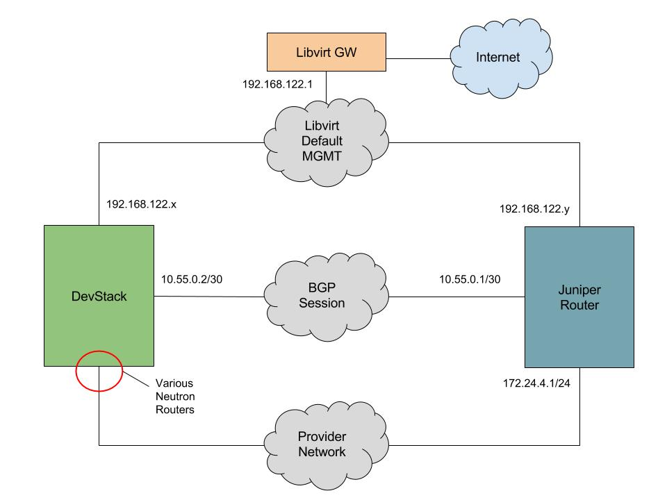

# OpenStack DevStack, Neutron Dynamic Routing, and Juniper vSRX


This README describes how to setup a DevStack instance and then connect it to a virtual Juniper router and establishing a BGP session using [Neutron Dynamic Routing](https://docs.openstack.org/neutron-dynamic-routing/latest/admin/bgp-speaker.html) to configure a BGP speaker that can announce dynamically created networks.

The two instances will be setup in a single, usually baremetal, KVM node using Libvirt.

## Network Automation and Integration

Often OpenStack clouds are deployed as completely individual units, islands if you will, that are not integrated with the network that they are deployed into. This actually makes it difficult to deploy OpenStack as considerable time is spent on figuring out how to "jam" OpenStack into an existing network. OpenStack is a complex and complicated system, and it's easy to make it worse by deploying it as a segregated system.

While the steps in this lab are manual, the point is to setup an OpenStack system which is integrated with an existing network. In this example, we are only deploying a small DevStack instance and a single Juniper router, but it doesn't take much to imagine the OpenStack deployment being larger and the network that it is integrating with being complex and made up of many nodes, maybe even a Service Providers core MPLS network.

Once deployed, when non-admin tenant self service Neutron networks are created in admin-configured subnet pools, the (sub)networks will be automatically be available globally via the Neutron router they are attached to. This is a form of network automation, and also solves some problems such as external access to VXLAN tenant networks (which, admittedly, can be solved in other ways as well).

Certainly network architecture can be, and usually is, extremely varied, but this is certainly one way to better integrate OpenStack into an existing network and solve some access problems, while also increasing network programmability.

## Network Diagram

IP addresses are arbitrary. Feel free to make changes, otherwise this document will assume what is shown on the diagram is what is in use.



## Requirements

* KVM node with enough resources to run a virtualized DevStack and Juniper router
* Preferably nested KVM enabled in the KVM node (In Ubuntu Xenial it is by default)
* Access to the Juniper vSRX image

### Memory and CPU Requirements

|               | Memory        | vCPU  |
| ------------- |:-------------:| -----:|
| DevStack      | 8-12GB        |   4+  |
| Juniper Router| 4GB           |   2   |

## How To Use This Document

This is a step by step document that shows the manual creation of a DevStack instance and Juniper router, and all the actions necessary to connect OpenStack to a Juniper router via a BGP session, and have OpenStack announce routes to the Juniper router.

Most of the commands are meant to be "cut and pasted" into terminal windows, either on the KVM node, the DevStack instance, or the Juniper router.

Future documents will include full automation as an option. However, sometimes the best way to learn is to set everything up manually at least once.

## Checkout This Repository on the KVM Server

On the KVM server cone this repository.

*NOTE: This assumes that the KVM/libvirt server has already been deployed on Ubuntu Xenial 16.04.*

```
git clone https://github.com/idx-labs/openstack-network-slicing/
cd openstack-network-slicing
```

## Libvirt Networking

We need at least three libvirt networks.

1. Default network - This is created by Libvirt/Virsh, and will be used for management
2. A network for the BGP session to occur over
3. A network that will become the provider network, and where the Neutron routers will have their external gateway/interface.

The DevStack instance will have three interfaces, one on each of these networks. The same will occur for the Juniper vSRX router.

### Create Libvirt Networks

On the KVM node:

```
cd ~/openstack-network-slicing
virsh net-define bgp.xml
virsh net-start bgp
virsh net-autostart bgp
virsh net-define provider.xml
virsh net-start provider
virsh net-autostart provider
```

There should be at least three networks now: default, bgp, and provider.

```
$ virsh net-list
 Name                 State      Autostart     Persistent
----------------------------------------------------------
 bgp                  active     yes           yes
 default              active     yes           yes
 provider             active     yes           yes
```

## Deploy Juniper Router

### Obtain the Juniper vSRX Image

Juniper allows people to create accounts and [download the vSRX image](https://www.juniper.net/support/downloads/?p=vsrx#sw).

In this document we are using:

```
media-vsrx-vmdisk-17.3R1.10.qcow2
```

We assume the image is placed in `/var/lib/libvirt/images`.

### Create the VM on the KVM node.

On the KVM node, build an image based on the vSRX image.

```
export IMG_PATH=/var/lib/libvirt/images
sudo qemu-img create \
-f qcow2 \
-b ${IMG_PATH}/media-vsrx-vmdisk-17.3R1.10.qcow2 \
${IMG_PATH}/router.img
```

### Create cloud-init ISO

One the KVM node, create an ISO image that will be attached to the Juniper router virtual machine. The ISO image contains a base configuration that will configure the vSRX instance to be a packet router as opposed to a firewall.

```
cd ~/openstack-network-slicing/lab0
export IMG_PATH=/var/lib/libvirt/images
sudo mkisofs -l -o ${IMG_PATH}/router.iso juniper-config
```

Build the virtual router using `virt-install`.

*NOTE: The install can take a fair amount of time to complete.*

```
export IMG_PATH=/var/lib/libvirt/images
sudo virt-install --name router \
--cpuset=auto \
--ram=4096 \
--cpu SandyBridge,+vmx,-invtsc \
--vcpus=2 \
--arch=x86_64 \
--disk path=${IMG_PATH}/router.img,size=16,device=disk,bus=ide,format=qcow2 \
--disk path=${IMG_PATH}/router.iso,device=cdrom,bus=ide \
--boot hd \
--os-type linux \
--os-variant rhel7 \
--network=network:default,model=virtio \
--network=network:bgp,model=virtio \
--network=network:provider,model=virtio \
--import
```

In another terminal window, run:

```
virsh console router
```

Once the router hits the login prompt, login with:

```
username: root
password: P@ssw0rd
```

Then shut down the router.

```
cli> request system power-off
```

The virt-install command should exit.

Then restart the router.

```
virsh start router
```

After a few minutes the login should be available again from virsh console.

*NOTE: The Juniper router can take up to 10 minutes to start up.*

```
virsh console router
```

Login use the same username and password as mentioned previously.

Set an fxp0 to use dhcp.

```
root# set interfaces fxp0 unit 0 family inet dhcp-client

[edit]
root# show | compare
[edit interfaces fxp0 unit 0]
+     family inet {
+         dhcp;
+     }

[edit]
root# commit
commit complete
```

Then check what IP it recieved.

```
root> show interfaces terse fxp0       
Interface               Admin Link Proto    Local                 Remote
fxp0                    up    up
fxp0.0                  up    up   inet     192.168.122.219/24
```

Above we recieved .219.

ssh into the router using that IP.

```
$ ssh root@192.168.122.219
Password:
--- JUNOS 17.3R1.10 built 2017-08-23 06:47:03 UTC
root@%
```

### Configure the Juniper Router

Login to the router and configure it from a `conf#` session and commit the changes.

*NOTE: The full set of commands can be seen [here](router-set.txt).*

```
set system host-name router
set interfaces ge-0/0/0 unit 0 family inet address 10.55.0.1/24
set interfaces ge-0/0/1 unit 0 family inet address 172.24.4.1/24
set interfaces lo0 unit 0 family inet address 1.1.1.1/32
set routing-options router-id 1.1.1.1
set routing-options autonomous-system 100
set protocols bgp group external-peers type external
set protocols bgp group external-peers multihop ttl 3
set protocols bgp group external-peers passive
set protocols bgp group external-peers neighbor 10.55.0.2 peer-as 200
set policy-options policy-statement BGP_NEXTHOP from protocol bgp
set policy-options policy-statement BGP_NEXTHOP from neighbor 10.55.0.2
set policy-options policy-statement BGP_NEXTHOP then next-hop 172.24.4.1
```

Note the "passive" settings and policy statements. The DevStack BGP agent is not listening on port 179, the Juniper router can't connect to it, so it must be set to passive.

## Deploy DevStack

### Create Virtual Machine

On the KVM node, download the Ubuntu cloud image.

```
cd /var/lib/libvirt/images
sudo wget https://cloud-images.ubuntu.com/xenial/current/xenial-server-cloudimg-amd64-disk1.img
```

Resize the image. By default it's only 2.2GB. Add 38GB to make it ~40GB.

```
sudo qemu-img resize /var/lib/libvirt/images/xenial-server-cloudimg-amd64-disk1.img +38G
```

Create a backing image.

```
sudo qemu-img create -f qcow2 \
-b /var/lib/libvirt/images/xenial-server-cloudimg-amd64-disk1.img \
/var/lib/libvirt/images/devstack.img
```

Create an ISO that will configure the instance with a default password.

```
cd /home/ubuntu/openstack-network-slicing/lab0
sudo genisoimage \
-output /var/lib/libvirt/images/devstack.iso \
-volid cidata \
-joliet \
-rock cloud-init/user-data cloud-init/meta-data
sudo chmod 777 /var/lib/libvirt/images/cloud-init.iso
```

Now define and create the virtual machine.

```
sudo virsh define devstack.xml
sudo virsh start devstack
sudo virsh console devstack
```

Once on the console, and the VM boots up, login as:

```
username: ubuntu
password: P@ssw0rd
```

Then find out the IP that the instance received from the `default` libvirt network.

ssh into the devstack instance.

```
ssh 192.168.122.x
```

### Deploy DevStack

#### Install DevStack

Add a `stack` user.

```
sudo useradd -s /bin/bash -d /opt/stack -m stack
echo "stack ALL=(ALL) NOPASSWD: ALL" | sudo tee /etc/sudoers.d/stack
sudo passwd stack
# set the password to "stack" or something else that you prefer
```

At this point, relogin with the stack user.

```
exit
ssh stack@192.168.122.x
```

Clone devstack and checkout a stable branch.

```
git clone https://git.openstack.org/openstack-dev/devstack
cd devstack
git checkout stable/pike
```

From the KVM node where this repository was cloned, scp the `local.conf` file to the DevStack instance in `~/devstack`.

```
# NOTE: On the KVM node...
cd /home/ubuntu/openstack-network-slicing/lab0
scp local.conf stack@192.168.122.x:~/devstack/
```

Log back into the DevStack instance and run `stack.sh`.

*NOTE: We will run the ./stack.sh script from a screen session in case our ssh session is lost.*

```
cd ~/devstack
screen -R install
./stack.sh
```

Get a coffee, this will take 30-50 minutes.

#### Test DevStack

Once the deploy has completed, add the below to `~/.profile` on the DevStack node.

```
export OS_PROJECT_DOMAIN_NAME="default"
export OS_IDENTITY_API_VERSION=3
alias os=openstack
```

Source `.profile`.

```
. ~/.profile
```

The below variables should exist in the bash session.

```
stack@ubuntu:~/devstack$ env | grep OS_
OS_IDENTITY_API_VERSION=3
OS_PROJECT_DOMAIN_NAME=default
```

Source openstack credentials.

```
. ~/devstack/accrc/admin/admin
```

List networks.

*NOTE: The openstack command is aliases to a shorter version `os`.*

```
$ os network list -c Name
+---------+
| Name    |
+---------+
| public  |
| private |
+---------+
```

### Configure DevStack Post-Deployment

#### Setup Interfaces

DevStack will not configure the interface we intend to use as the BGP session interface.

Ensure ens4 is configured by entering the below into `/etc/network/interfaces.d/ens4.cfg`.

*NOTE: The following commands are all run from the DevStack instance, not from the KVM node.*

```
auto ens4
iface ens4 inet static
  address 10.55.0.2
  netmask 255.255.255.0
```

Then bring up the interface.

```
sudo ifup ens4
```

Validate the interface.

```
ping 10.55.0.2
```

#### IMPORTANT!: Flush IPs on br-ex and set ens6 up

DevStack configures br-ex with the 172.24.4.1 gateway, which is not desirable for this deployment as we want the Juniper router to be the default gateway for the provider network.

```
sudo ip address flush dev br-ex
sudo ip link set ens6 up
```

#### BGP DR Agent

Once DevStack has been deployed, we can configure the DR Agent.

Configure a unique router id in `/etc/neutron/bgp_dragent.ini`. For the purposes of this document, we will use the IP address that is being set on the ens4 interface, `10.55.0.2`.

```
$ grep -v "^#\|^$" bgp_dragent.ini
[DEFAULT]
debug = True
verbose = True
[bgp]
bgp_speaker_driver = neutron_dynamic_routing.services.bgp.agent.driver.ryu.driver.RyuBgpDriver
bgp_router_id = 10.55.0.2
```

Restart the Neutron BGP agent.

```
sudo systemctl restart devstack@q-dr-agent.service
```

#### OpenStack Network Configuration

There are a few things we need to setup on the DevStack instance.

First, on the DevStack node, ensure credentials are sourced.

```
. ~/devstack/accrc/admin/admin
```

Remove various preconfigured DevStack subnets and deconfigure router.

```
openstack router remove subnet router1 private-subnet
openstack subnet delete private-subnet
openstack subnet pool delete shared-default-subnetpool-v4
openstack router unset --external-gateway router1
openstack subnet delete public-subnet
```

Setup address scopes.

```
neutron address-scope-create --shared public 4
neutron subnetpool-create --pool-prefix 172.24.4.0/24 \
  --address-scope public provider
neutron subnetpool-create --pool-prefix 10.0.0.0/16 \
  --address-scope public --shared selfservice
neutron subnet-create --name provider --subnetpool provider --prefixlen 24 public
neutron subnet-create --name selfservice --subnetpool selfservice  --prefixlen 24 private
```

Configure Neutron router.

```
openstack router set --external-gateway public router1
openstack router add subnet router1 selfservice
```

Setup the BGP speaker.

```
neutron bgp-speaker-create --ip-version 4 \
 --local-as 200 bgp-speaker
neutron bgp-speaker-network-add bgp-speaker public
```

#### Validate Advertised Routes

Show what routes will be announced/advertised.

```
$ neutron bgp-speaker-advertiseroute-list bgp-speaker
+-------------+------------+
| destination | next_hop   |
+-------------+------------+
| 10.0.0.0/24 | 172.24.4.6 |
+-------------+------------+
```

#### Add Peer

Create a peer then add it to the bgp-speaker instance.

```
neutron bgp-peer-create --peer-ip 10.55.0.1 \
  --remote-as 100 bgp-100-200
neutron bgp-speaker-peer-add bgp-speaker bgp-100-200
```

At this point the BGP session should be up and the DevStack instance should be announcing routes to the Juniper router, it's peer.

## Validate Connectivity

BGP summary:

```
root@router> show bgp summary
Groups: 1 Peers: 1 Down peers: 0
Table          Tot Paths  Act Paths Suppressed    History Damp State    Pending
inet.0               
                       1          1          0          0          0          0
Peer                     AS      InPkt     OutPkt    OutQ   Flaps Last Up/Dwn State|#Active/Received/Accepted/Damped...
10.55.0.2               200          5          2       0       2          27 1/1/1/0              0/0/0/0
```

Show routes. Note that 10.0.0.0/24 is a BGP route from 10.55.0.2.

```
root@router> show route    

inet.0: 8 destinations, 8 routes (8 active, 0 holddown, 0 hidden)
+ = Active Route, - = Last Active, * = Both

1.1.1.1/32         *[Direct/0] 00:13:29
                    > via lo0.0
10.0.0.0/24        *[BGP/170] 00:00:56, localpref 100, from 10.55.0.2
                      AS path: 200 I, validation-state: unverified
                    > to 172.24.4.9 via ge-0/0/1.0
10.55.0.0/24       *[Direct/0] 00:13:29
                    > via ge-0/0/0.0
10.55.0.1/32       *[Local/0] 00:13:29
                      Local via ge-0/0/0.0
172.24.4.0/24      *[Direct/0] 00:13:29
                    > via ge-0/0/1.0
172.24.4.1/32      *[Local/0] 00:13:29
                      Local via ge-0/0/1.0
192.168.122.0/24   *[Direct/0] 00:29:52
                    > via fxp0.0
192.168.122.200/32 *[Local/0] 00:29:52
                      Local via fxp0.0

inet6.0: 1 destinations, 1 routes (1 active, 0 holddown, 0 hidden)
+ = Active Route, - = Last Active, * = Both

ff02::2/128        *[INET6/0] 00:38:24
                      MultiRecv
```

Ping 10.0.0.1, which is the Neutron gateway for the selfservice subnet.

```
root@router> ping 10.0.0.1   
PING 10.0.0.1 (10.0.0.1): 56 data bytes
64 bytes from 10.0.0.1: icmp_seq=0 ttl=64 time=3.916 ms
64 bytes from 10.0.0.1: icmp_seq=1 ttl=64 time=2.426 ms
64 bytes from 10.0.0.1: icmp_seq=2 ttl=64 time=2.214 ms
^C
--- 10.0.0.1 ping statistics ---
3 packets transmitted, 3 packets received, 0% packet loss
round-trip min/avg/max/stddev = 2.214/2.852/3.916/0.757 ms

root@router>
```

## Conclusion

Now OpenStack is connected via BGP to a Juniper router and we are on our way to all kinds of interesting automation.

## Bonus Work

TBD - Eg. boot instances and configure networks.

## Todo

* DONE: Show configuring Juniper router
* Show deploying KVM instance for DevStack
* Change neutron commands to be openstack commands
* DONE: Show announced routes, reachability on Juniper router
* Clean up network diagram, add interface names
* Don't use virt-install to create the Juniper router
* DONE: Set fxp0 as dhcp in juniper.conf iso
* add stack user creation to user-data
* Using devstack takes too long for a lab, need a faster way to create an openstack image
* Check into [validation-state: unverified](https://kb.juniper.net/InfoCenter/index?page=content&id=KB27919) in the show route output
* Re-order to have the DevStack build first so that the Juniper router can be setup while DevStack is installing
